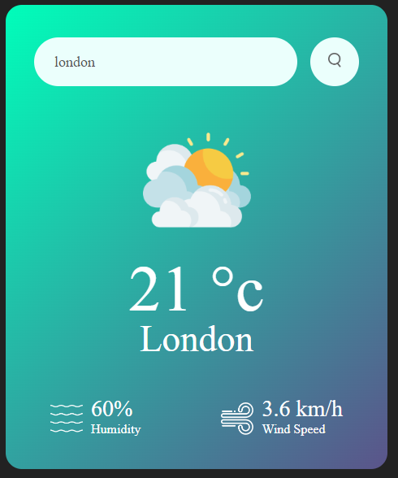

# 30JavascriptProjects

- Weather App

## Weather App

We can get the current weather data from the API  OpenWeatherMap and display the weather information like Temperature,  Weather condition, Humidity and Wind Speed according to the city on our website or app.

