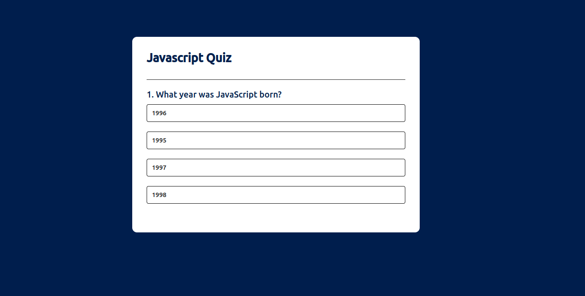
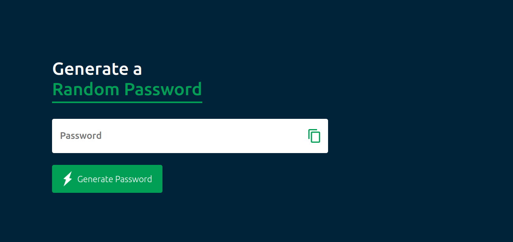
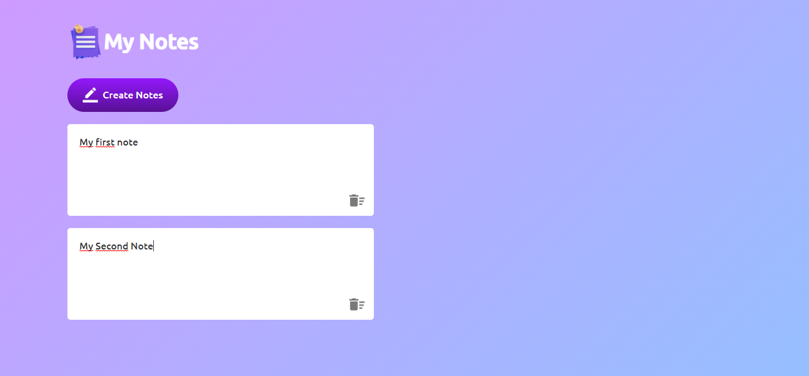

# 30JavascriptProjects

- Weather App
- To-Do List App
- Quiz App
- Password Generator App
- Notes App

## Weather App

We can get the current weather data from the API OpenWeatherMap and display the weather information like Temperature, Weather condition, Humidity and Wind Speed according to the city on our website or app.

## To-Do List App

In this To Do list we can add our task list and mark that task as completed or incomplete. We can write the new task in the input box and click on the "Add" button then the new task will be added to the list.
We can click on the task name to mark it as completed or incomplete task. We will add a close icon to delete the particular task from the ToDo list.

## Quiz App

In this quiz app we can add multiple questions and 4 answer choices for each questions. When you select any one answer the the answer button's background color will become green if it is correct answer and the background color will become red if it is wrong answer.
After selecting one answer you can not change the answer, you can only go for next question.
When user will submit the answer of last question and click on the next button. Then it will display the score.

## Password Generator App

This app will generate a strong password with Upper case, lower case, numbers and symbols. We will also add password copy icon to copy the new generated password.

## Notes App

This app create personal notes, that will store the notes in your web browser using Local Storage. So that if you close and restart the browser then also it will display your saved notes.

