# 30JavascriptProjects

- Weather App
- To-Do List App
- Quiz App
- PasswordGenerator
- Notes App
- Age Calculator App
- Quote Generator App
- QR Generator App
- Toast Notification

## Weather App

We can get the current weather data from the API OpenWeatherMap and display the weather information like Temperature, Weather condition, Humidity and Wind Speed according to the city on our website or app.

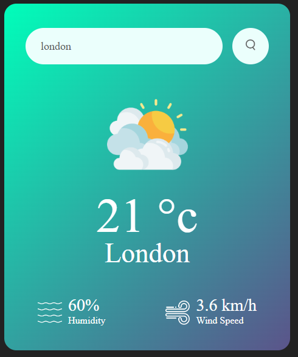

## To-Do List App

In this To Do list we can add our task list and mark that task as completed or incomplete. We can write the new task in the input box and click on the "Add" button then the new task will be added to the list.
We can click on the task name to mark it as completed or incomplete task. We will add a close icon to delete the particular task from the ToDo list.

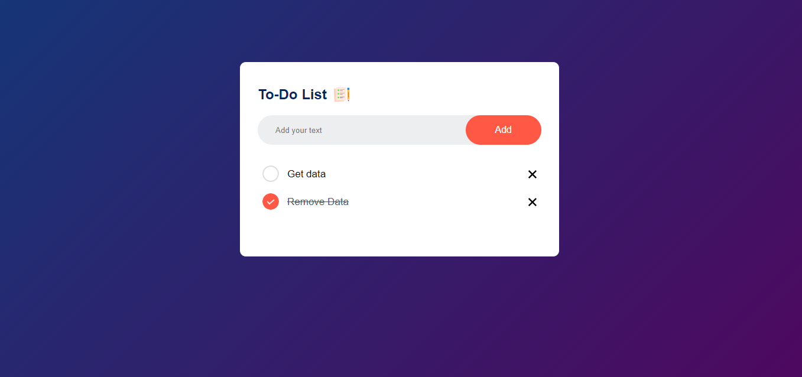

## Quiz App

In this quiz app we can add multiple questions and 4 answer choices for each questions. When you select any one answer the the answer button's background color will become green if it is correct answer and the background color will become red if it is wrong answer.
After selecting one answer you can not change the answer, you can only go for next question.
When user will submit the answer of last question and click on the next button. Then it will display the score.

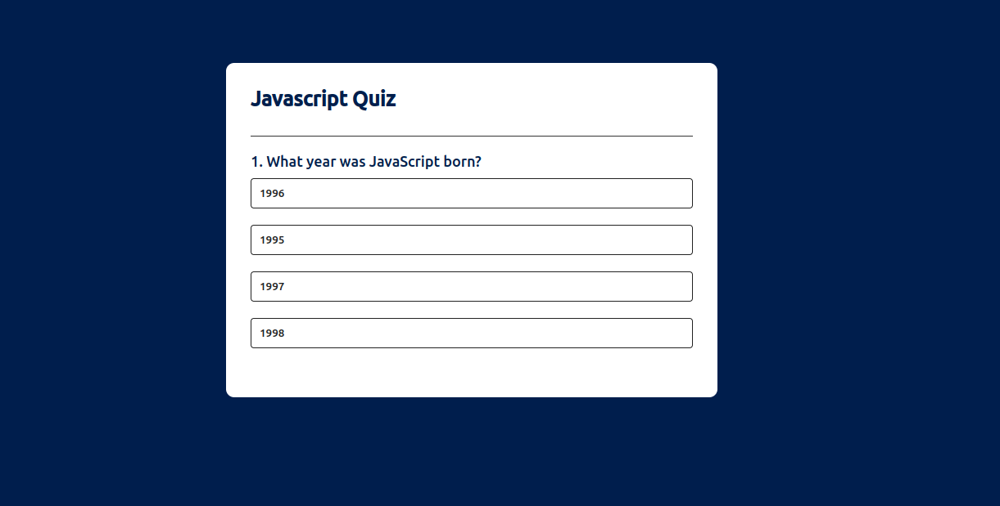

## Password Generator App

This app will generate a strong password with Upper case, lower case, numbers and symbols. We will also add password copy icon to copy the new generated password.

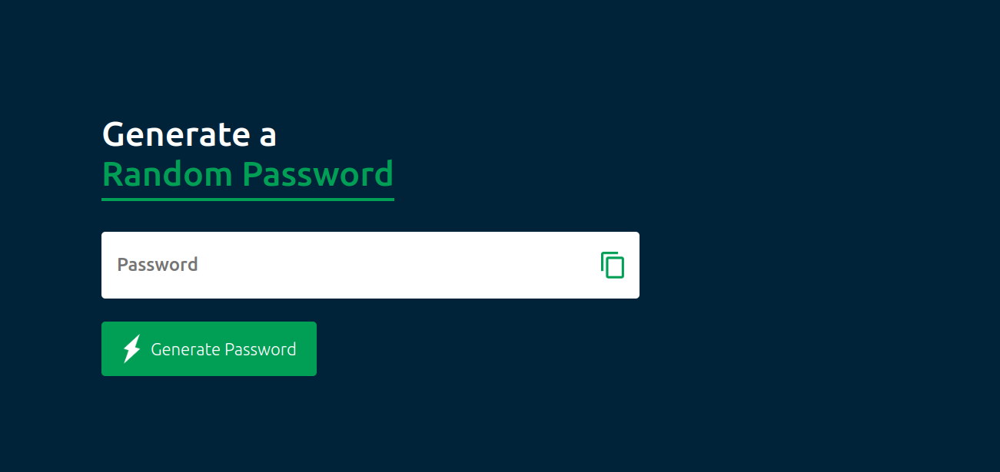

## Notes App

This app create personal notes, that will store the notes in your web browser using Local Storage. So that if you close and restart the browser then also it will display your saved notes.

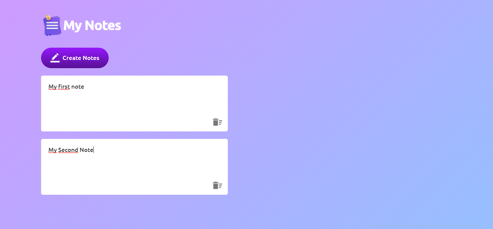

## Age Calculator App

This age calculator app has one data input box, where it display the calendar to pick date of birth. after selecting date of birth click on calculate button then it will display the exact age till today. This age calculator app will display the exact age in years, months and days.

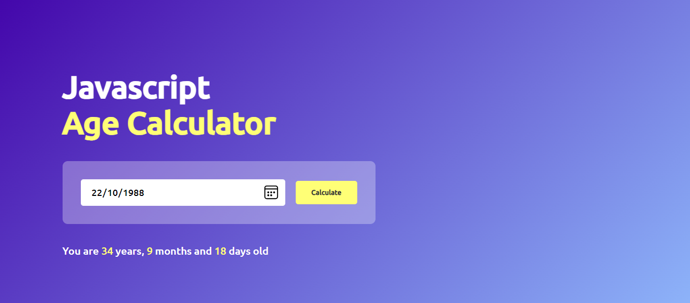

## Quote Generator App

Every time people will visit this website it will display a new Quote. In this code generator website we will add a button that will generator new quote when clicked on it. and there will be one more button to share this quote on the Twitter.

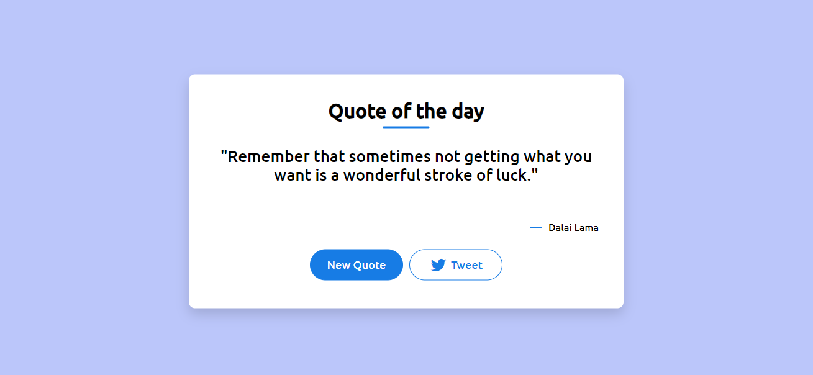

## QR Code Generator App

This QR Code Generator can make QR Code of any Text or Link. You will get the QR Code in Image format.

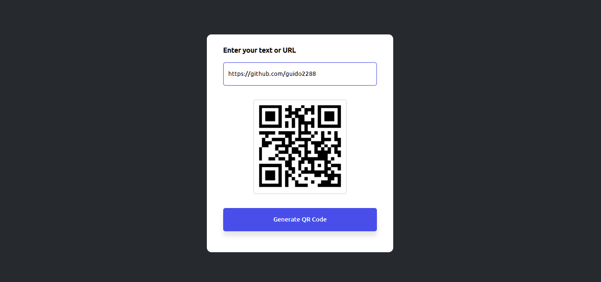

## Toast Notification

Toast notification for website or snack bar notification using HTML CSS and JavaScript. We will add one progress bar also in this toast. This snack bar will be animated with the help for CSS animation. This toast notification will disappear automatically after fixed time.

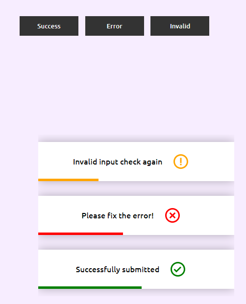

## Music Player

Music player for website, where we will add song and song's control button to play or pause the song. we will also add progress bar that will display the current time of the song.

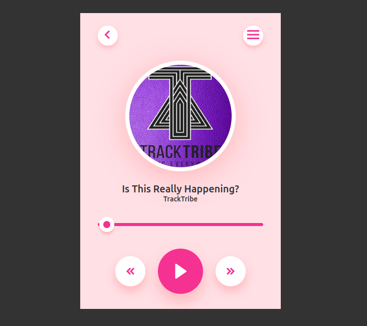

## Stop Watch

We will display the timer and there will be 3 buttons to control this stopwatch timer. We can Start, Stop and Reset thetimer in this Stopwatch.

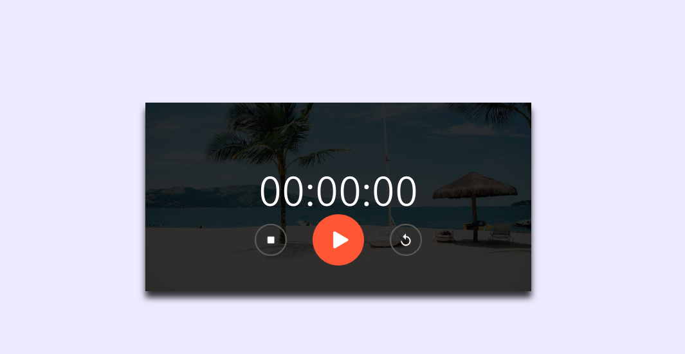

## Calculator App

In this calculator we will create UI design using HTML and CSS then we will add calculator functionality with the help for simple JavaScript code.

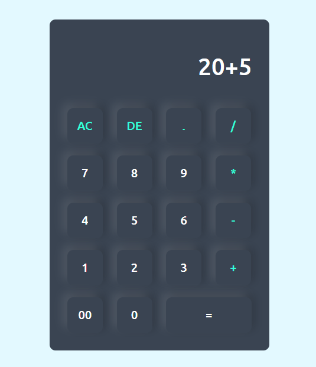

## Popup

Model box or Popup website using HTML, CSS and JavaScript with animations.

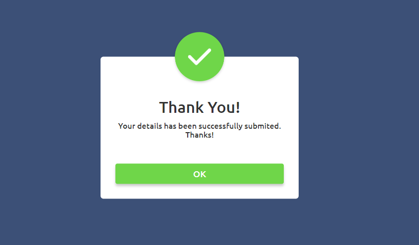

## PasswordToggle

In this password field we will add an icon to hide and display the password written in the input filed. The icon will be updated too when we click on it.

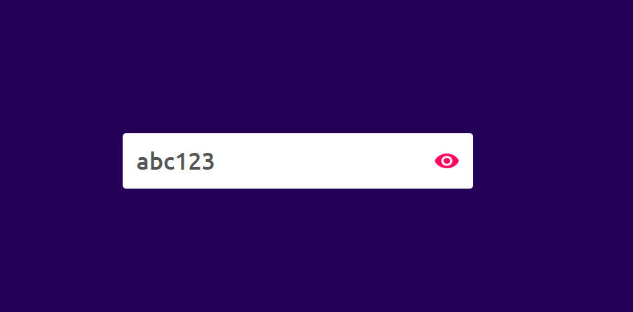

## DarkMode

Light mode and dark mode switching option on website using HTML CSS and JavaScript.

## FormValidation

In this contact form we will validate the name, email, phone number and text message field using JavaScript.

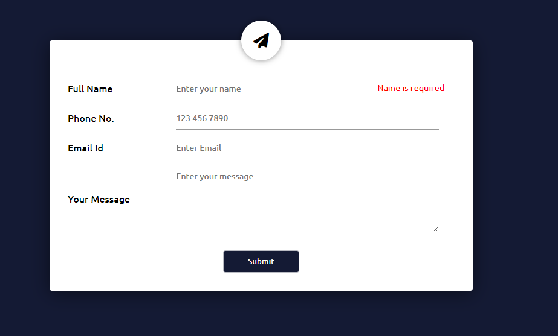

## Image Gallery

Horizontal Scrolling with mouse wheel Using JavaScript

## Email Subscription

On this website we will add an Email subscription form or newsletter subscription form also. We will send this HTML form data on Google Sheets so that we can see the email subscribers list on Google Sheets.

## Password Strength

Is password input box, and when we will enter anything in the password field then it will display the password strength and it will also change the border color of password field according to the password strength.

## Voice Converter

Text to speech converter or Text to voice generator app using HTML CSS and JavaScript.We can generate the speech in different voices.

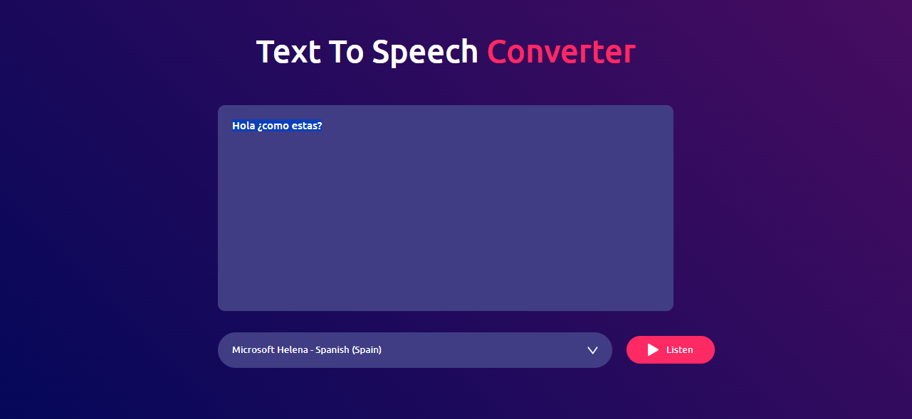

## Coming Soon

Coming soon page design or website under maintenance page design. Time and date countdown using JavaScript that will update every seconds and it will display the days hours minutes and seconds left to launch the website.

## Image Transition

Website design where we add one image, when we will move the cursor over this image, it will display the transparent background image.
We will also add a vertical line and an arrow icon that will separate the original image and transparent background image.

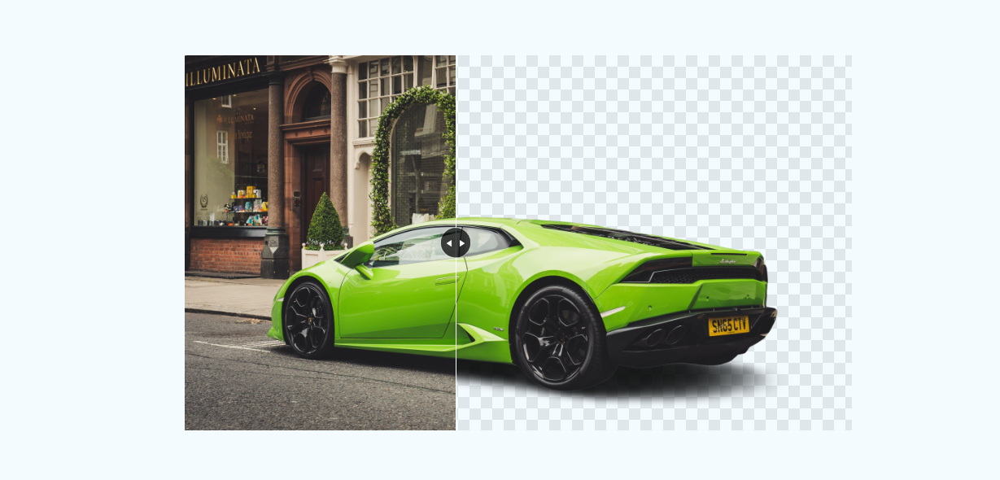

## Mini Calendar

This calendar will display the today's date, day, month and year. This date will be updated every day.

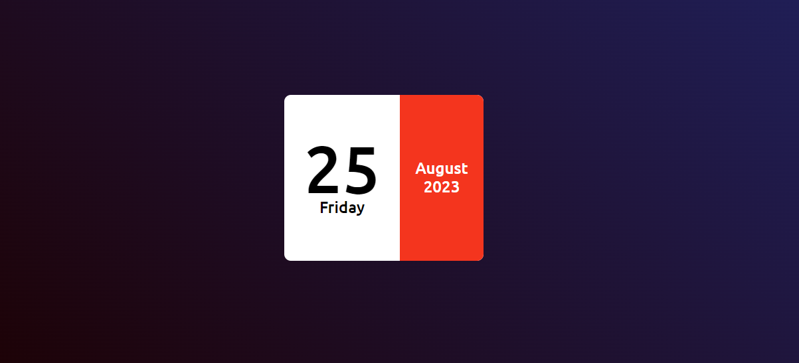

## Select Menu

Custom select menu using HTML, CSS and JavaScript. When I click on this select field, it will open the options and here you can see the icon is rotating.

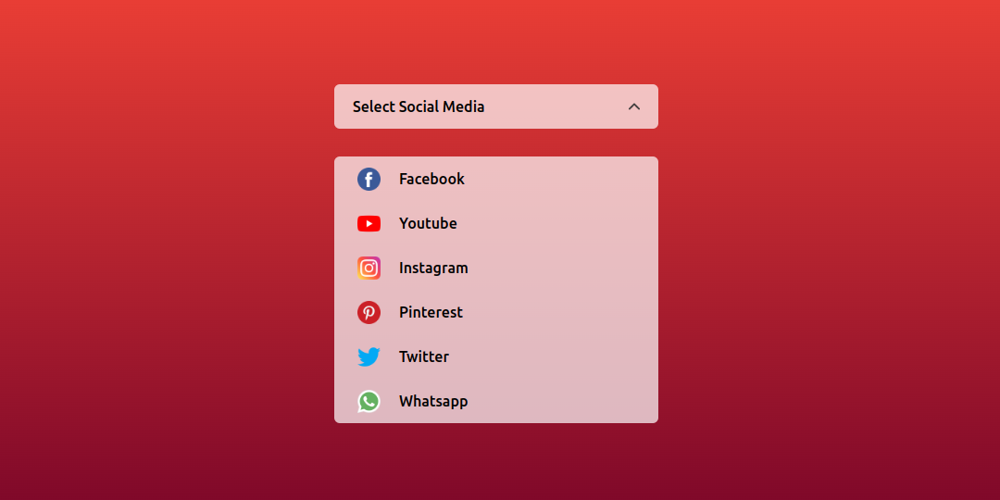

## Progress Bar

Neomorphism Design Progress Bar.

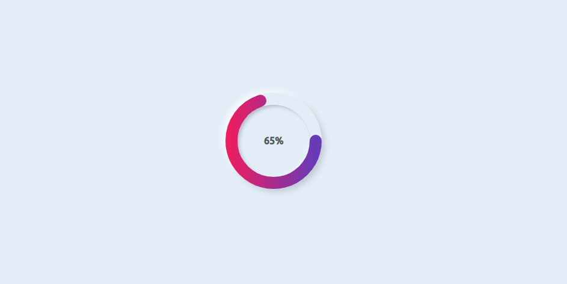

## Product Page

Product page design that can be used on ecommerce website. On this product page design we will display the product image gallery and product description. We will also add option to choose the product variation before buying.

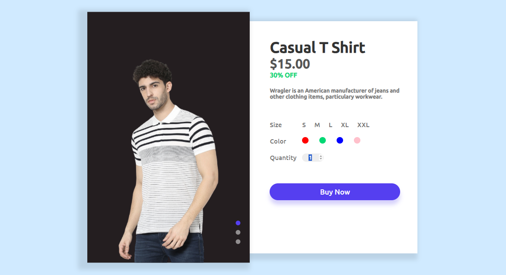

## CryptoCurrency Page

On this website we will display the live price of the cryptocurrency with free api, we will display the price of cryptocurrency with the help of JavaScript and jQuery. 

## Digital Clock

 Digital clock that will display the current time in Hours, Minutes and second. This JavaScript clock display the time as per Local time zone.

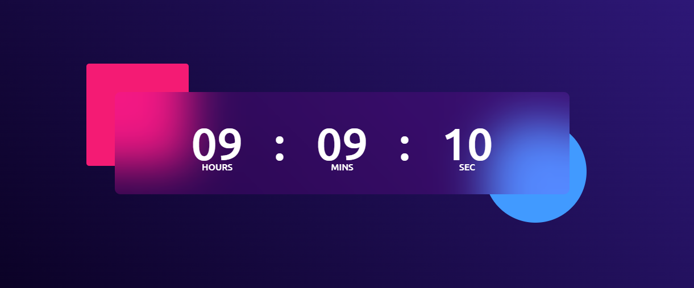